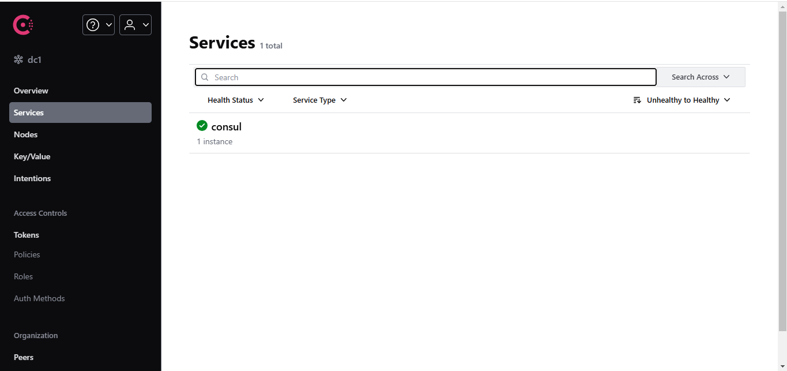

# Common:
```console
cd consulRegistryServer
```
# Windows:
```console
consul_server_command.bat
```
# Linux:
```console
chmod +x consul_server_command.sh
./consul_server_command.sh
```

# Result:
Access http://localhost:8500/ui/dc1/services. If you see the result as shown in the image below, it means the installation was successful.
