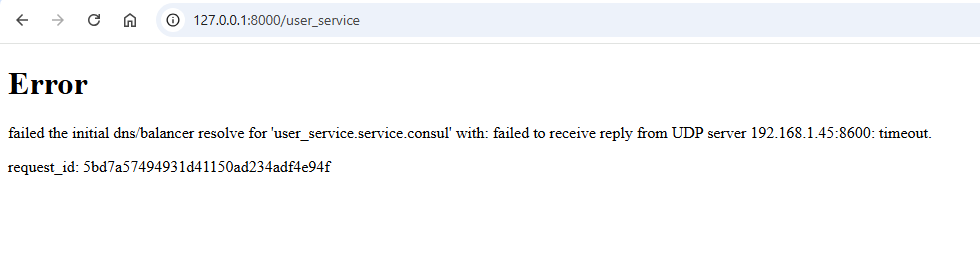

# Common:
```console
cd kongAPI
```

# Windows:
- Create .env file:  
**Note:** Override your value in the **.env** file
```console
echo CONSUL_DNS=Your_Consul_DNS > .env
echo CONSUL_SERVER_ADDRESS=Your_Consul_Server_Addr >> .env
echo KONG_ADMIN_ADDRESS=Your_Kong_Admin_Addr >> .env
```
- Example for .env file:
```env
CONSUL_DNS=192.168.1.45:8600
CONSUL_SERVER_ADDRESS=http://localhost:8500
KONG_ADMIN_ADDRESS=http://localhost:8001
```
- Run Kong database in Docker
```console
kong_database_cmd.bat
```
- Run Kong gateway in docker
```console
kong_command.bat
```
- Add services from Consul to Kong
```console
pip install -r requirements.txt
python main.py
```

# Linux:
- Create .env file:  
**Note:** Override your value in the **.env** file
```console
echo "CONSUL_DNS=Your_Consul_DNS" > .env
echo "CONSUL_SERVER_ADDRESS=Your_Consul_Server_Addr" >> .env
echo "KONG_ADMIN_ADDRESS=Your_Kong_Admin_Addr" >> .env
```
- Run Kong database in docker
```console
chmod +x kong_database_cmd.sh
./kong_database_cmd.sh
```
- Run Kong gateway in docker
```console
chmod +x kong_command.sh
./kong_command.sh
```
- Add services from Consul to Kong
```console
pip install -r requirements.txt
python main.py
```

# Error:
Sometimes you may encounter an error like the image below. Don't worry, try again 5 minutes later.


