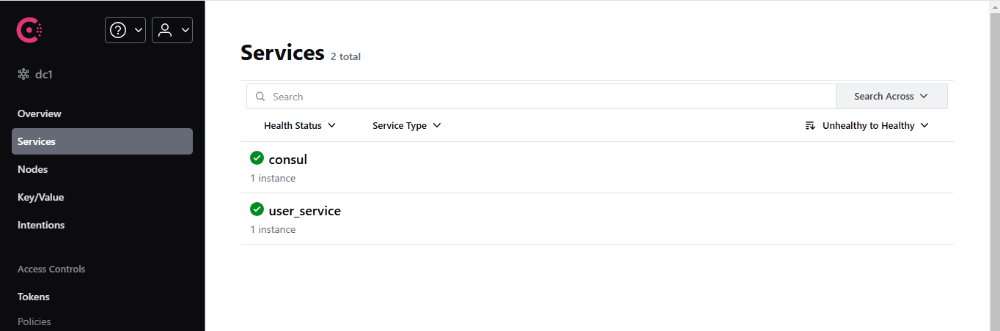

# Common:
```console
cd services\users
```
# Windows:
- Create .env file:  
**Note:** Override your value in the **.env** file
```console
echo CONSUL_SERVER_IP=Your_CONSUL_SERVER_IP > .env
echo PUBLIC_SERVICE_IP=Your_Public_Service_Ip >> .env
```
- Example for .env file:
```env
CONSUL_SERVER_IP=192.168.1.45
PUBLIC_SERVICE_IP=192.168.1.45
```
- Run service on docker
```console
user_service_command.bat
```

# Linux:
- Create .env file:  
**Note:** Override your value in the **.env** file
```console
echo "CONSUL_SERVER_IP=Your_CONSUL_SERVER_IP" >> .env
echo "PUBLIC_SERVICE_IP=Your_Public_Service_Ip" >> .env
```
- Run service on docker
```console
chmod +x user_service_command.sh
./user_service_command.sh
```

# Result:
Access http://localhost:8500/ui/dc1/services. If you see the result as shown in the image below, it means the installation was successful.
